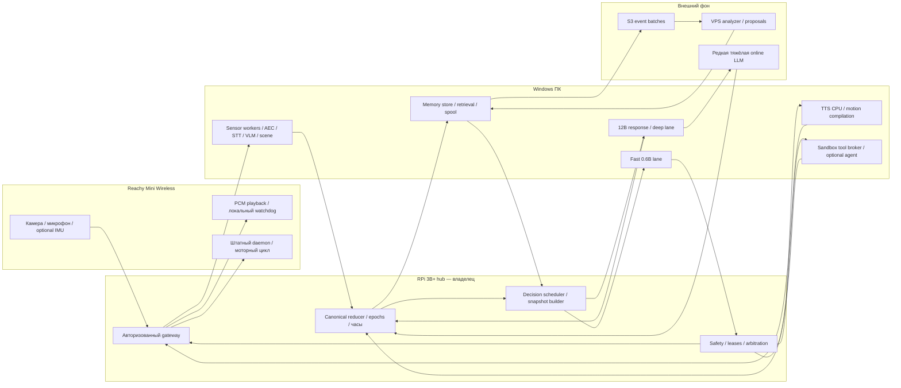
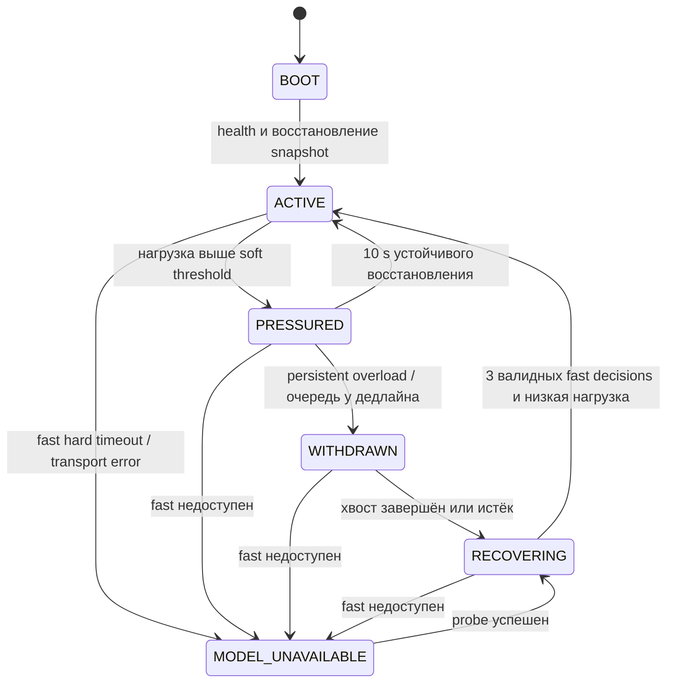

# Требования и архитектура

## Инварианты и разрешение противоречий

| ID | Требование | Проверяемое решение |
|---|---|---|
| R01 | Непрерывное обращение к LLM, включая тишину | Каждый decision tick создаёт ровно один новый fast request; wait — реальное решение модели. Журнал различает попытку, ответ, валидное решение и пропуск при недоступности. |
| R02 | Медленная обработка не останавливает жизнь | Deep/VLM/STT/tool tasks имеют отдельные очереди. Следующий fast tick видит их состояние и продолжает работу. |
| R03 | Hub без inference | На RPi только часы, reducer, управление очередями, компактная сборка входа, safety и транспорт. Все модели, embeddings, AEC-анализ и интерпретация сенсоров — на ПК. |
| R04 | Честное восприятие | Отсутствие датчика, mute, отсутствие результата, ошибка и stale различаются. Внутренние симуляции никогда не становятся измерениями. |
| R05 | Непрерывность без болтовни | Частота мышления отделена от частоты внешних проявлений. Решение renew/hold не перезапускает жест и не воспроизводит реплику. |
| R06 | Немедленное управление | Кнопка mute/stop обходит модель, обновляет epoch, отменяет PCM/движения и сохраняет mute. Самостоятельное включение микрофона запрещено. |
| R07 | Стабильная личность и память | Утверждения имеют тип, evidence и версии. Обновления — proposals, проверки и атомарное применение. Принципы доступа не меняет модель. |
| R08 | Расширяемость | Версионируемые sensor/tool/model adapters, capability registry и единый task/result contract. |
| R09 | Никаких выдуманных заряда/температур | Network RTT — сетевой факт; idle duration — время; fatigue — симуляция; battery остаётся unknown/unsupported до реального источника. |
| R10 | Перегрузка и доступность | Bounded queues, таймауты, one-shot уведомление, непрерывный fast lane при доступной модели; circuit breaker при недоступности. |

«Непрерывный» означает последовательность ограниченных вычислений во времени, не бесконечную частоту. Отрицательная задержка невозможна. Прототип использует self-clocked schedule: следующий запрос не раньше периода и не раньше завершения предыдущего. Пропущенные временные слоты не накапливаются, но каждая состоявшаяся итерация делает новый запрос. В degraded-режиме, например раз в 2–5 секунд, запросы продолжаются. Отдельный таймер управления и watchdog исполняется значительно чаще. Fast LLM не является сервоконтроллером.

Безопасный reflex может временно приглушить звук при уверенном начале перебивания и немедленно отменить команды при mute. Шум, музыка и novelty обновляют внимание; они не запускают обязательный танец или фразу. Нейросетевая классификация звука может быть детерминированной, но выбор внешнего поведения остаётся у LLM.

## Размещение



Hub — единственный authority для новых действий и current revision. ПК держит полные дескрипторы, raw RAM buffers и базу памяти; hub держит ограниченные проекции и журнал критичных переходов. До готовности новой retrieval-проекции используется предыдущая с age/version, без ожидания БД в fast lane. У ПК нет прямого канала управления Reachy. Каждое действие проходит hub. Штатный моторный цикл daemon остаётся на Reachy; пользовательское владение управляющим циклом на hub не означает перенос низкоуровневого регулирования моторов на RPi.

На роботе допустимы лишь захват/транспорт, PCM и уже существующее лёгкое VAD-окружение; новые inference или тяжёлое CV туда не переносятся. Локальный watchdog — исключение для разрыва связи: отвергает истёкшие команды и прекращает playback/косметическое движение, не принимает новые самостоятельные намерения. Без такого watchdog hub не может физически остановить Reachy при потере сети: это обязательная будущая доработка, не свойство нынешнего кода.

## Каноническое состояние и восприятие

Reducer на hub — single writer. Состояние включает world/scene, сенсоры и возраст результатов, focus, working memory, versions личности/принципов/памяти, optional pinned goal, task table, execution ledger, microphone epoch, interaction epoch, mode и self-model. Все результаты поступают в reducer как события. Данные с ПК — предложения наблюдений, а не команды.

У каждого сенсора есть advertised capability, producer boot id и sequence. `availability=unknown` означает, что проверка ещё не выполнена; `unsupported` — подтверждённо не предоставляется; `disabled` — операторский запрет; `offline` — известен, но недоступен. Отдельно задаётся `status=empty/pending/ready/error`, freshness вычисляется по capture time. Предыдущее готовое значение можно сохранить при новом pending task, но его timestamp не обновляется. `confidence=null` означает некалиброванную уверенность; число 0,95 из softmax не считается автоматически вероятностью истинности.

Первичные кандидаты потоков: PCM 16 kHz mono S16, RMS/noise floor/VAD/self-audio flags каждые 100–250 ms; STT partial/final с utterance id; YAMNet окна около секунды; camera keyframe 0,5–2 Hz и ограниченная VLM; pose/IMU из доступного daemon; software RTT/queue/latency. Частоты — проектные, фактические определяет проверка транспорта. Hub не анализирует PCM, только проверяет envelope и лимиты.

Scene model различает наблюдаемый объект, предположение о событии, собеседника и идентичность. «Человек A у камеры» — временный track, не установленная личность. Перекрывающаяся речь может быть unassigned; diarization не обещается по двум словам. Ошибочная транскрипция не становится пользовательским предпочтением. Last words хранятся с TTL и utterance revision: partial заменяется final, не создавая второго обращения человека.

Свежесть и дедлайн независимы: задача может завершиться вовремя, но описывать старую сцену. Capture timestamp сохраняется во всех производных. Для часов используется monotonic deadline на hub и оценка clock offset ± uncertainty для источников; сравнивать чужие monotonic напрямую нельзя. Скачок wall clock не продлевает lease и TTL. При большой uncertainty быстрые движения по источнику запрещаются, результат становится историческим.

## Внимание и внутренняя динамика

Избирательное внимание агрегирует novelty, prediction error, confidence, релевантность текущей цели, обращённость речи и давность. Фиксированный reducer предлагает top-3 кандидата, LLM выбирает фокус. Новому кандидату требуется превосходство score примерно на 0,15 в двух окнах; минимальная фиксация фокуса 1,5 s. Прямое обращение/остановка обходят hysteresis. Habituation снижает вес повторяющегося подтверждённого фона, но не выключает запись; внезапное изменение того же шума снова повышает novelty. История внимания хранит attended/dismissed/returned и время.

Внешняя тишина не равна неизменности: идут реальные часы, меняются age/RTT/queue/pose, RMS и acoustic baseline при включённом mic. Значения не обязаны меняться; если RMS остался прежним, это честный повторный замер. В mute акустика не обновляется вообще. Нельзя генерировать шум, «новый звук» или fake servo current, чтобы занять LLM.

Симуляция хранится отдельно: mood valence, arousal, curiosity, simulated fatigue, confidence и need for social contact/exploration/rest. Для величины x применяется `x += (target-x)*(1-exp(-dt/tau)) + bounded_evidence_impulse`, затем clamp [-1,1] для mood valence и [0,1] для остальных drives. Источники импульсов — подтверждённые события и собственная история усилия/внимания, не случайный шум. Примеры: arousal tau 30–120 s после резкого звука, mood tau 20–60 min, curiosity растёт от незавершённого интереса и уменьшается после удовлетворения, fatigue растёт от длительной активности и очередей, отдых снижает её. Эти параметры калибруются поведением; simulated fatigue не доказывает перегрев GPU или разряд батареи.

Необязательная небольшая seeded вариативность допустима только внутри approved cosmetic motion: амплитуда и фаза с пометкой `origin=simulated`, воспроизводимым seed. Она не заменяет восприятие и не создаёт фактов. Лучше первые версии обойтись без random: вариативность от истории позы, длительности внимания и незавершённых намерений уже объяснима.

Инициатива — предложение продолжить интерес, иногда вопрос или наблюдение. Silence budget: внешний повод и useful content либо долго живущий interest; cooldown речевой инициативы первоначально 10 min, quiet hours запрещают инициативную речь. Повтор после игнорирования требует нового основания; decline закрывает план. LLM всё равно думает в quiet mode. Цель может отсутствовать; смысл существования не требует постоянной задачи.

## Состояния и независимые оси



`quiet=true/false`, `microphone=enabled/disabled`, `network=connected/degraded/lost`, `motor=allowed/stopped/faulted` и `speech=idle/preparing/playing/interrupted` — ортогональные оси. Возвращение из overload не отменяет quiet или mute. BOOT восстанавливает persistently muted состояние, goal и версии; незавершённые действия не переигрывает. Реальный hardware fault блокирует движения даже при ACTIVE.

В PRESSURED урезаются необязательные части fast view и фоновые VLM/tools; output cap не снижается ниже проверенного минимума валидного FastChoice; непрерывный fast lane остаётся. WITHDRAWN допускает лишь bounded wait/think decisions, остановку и optional one-shot короткую реплику. Реплика идёт через guard и отдельный CPU TTS, может быть пропущена при занятости/quiet/mute. «Я запутался, дай секунду» — персонажная формулировка. «Перегрелся» разрешено как аппаратная причина только при измерении с конкретным датчиком; иначе предпочитать слово «запутался».

Начальные overload guards: EWMA fast > 1,5 s или p95 > 2 s, high queue occupancy > 75% в течение 5 s → PRESSURED; fast lane debt > 3 s, deep > soft timeout и очередь > 90% в течение 5 s → WITHDRAWN. Исключённый или отсутствующий сенсор температуры не участвует. У WITHDRAWN собственный deadline 15 s: cancel/coalesce всего фона, собрать согласованный итог по готовым данным; через 30 s все старые tasks terminal или quarantined. Зависшая coroutine не удерживает режим: worker supervisor снимает execution lease, оставляет quarantine запись и закрывает приём результатов. Перезапуск процесса с другими active tenants недопустим без изоляции.

При hard timeout fast request логируется как failed, без решения, поздний ответ отбрасывается; circuit breaker открывается после 3 неудач. MODEL_UNAVAILABLE выполняет health/probe с backoff 1,2,4,8,15 s (предел 15 s), а не бесконечно множит запросы. На этой оси требование успешных непрерывных LLM-итераций физически невыполнимо; метрика gap это показывает. Online API не применяется тайно как постоянный заместитель. При исправной CPU fast модели потеря main GPU lane не прерывает fast цикл.

## Непрерывный цикл и асинхронная работа

```python
# Псевдокод 1.1. Никакого запуска реального цикла на этапе проектирования.
async def decision_loop():
    due = clock.now()
    while not operator_shutdown:
        await clock.sleep_until(due)  # event ingress и safety работают независимо
        if not fast_endpoint.execution_slot_confirmed_free() or circuit.open:
            log_model_gap_until_next_probe()  # не cached wait и не валидный tick
            await circuit.probe_when_due_without_loading_models()
            due = clock.now() + circuit.backoff
            continue
        started = clock.now()
        snap = reducer.atomic_copy()  # короткая copy, не lock вокруг I/O
        request = bind_request(snap, project_fast_view(snap))
        # trusted binding: boot ids, epochs, intent/evidence aliases, deadline.
        register_attempt_and_acquire_fast_slot(request)
        try:
            raw = await fast_endpoint.infer(request, output_schema=FastChoice,
                                            max_tokens=192, deadline=started+3.0)
            choice = parse_and_validate(raw)  # output length/format тоже проверяются
            decision = expand_choice_with_trusted_binding(choice, request)
            with reducer.transaction():
                accepted = guard(decision, reducer.current, request.binding)
                commit_decision_and_action_outbox(accepted)
                # lookup/revalidate speech.commit proposal здесь, атомарно с intent.
            circuit.record_success()
        except InvalidChoice:
            log_rejection(request)  # не попытка regex salvage или второе infer в tick
        except (Deadline, TransportError):
            revoke_request_result_lease(request)
            fast_endpoint.request_cancel(request)  # best effort, НЕ release slot
            log_failed_attempt(request)
            circuit.record_failure()
        finally:
            # release только completion/stop ack/process exit. Иначе quarantine.
            fast_endpoint.reconcile_execution_slot(request)
        due = max(started + adapted_period(), clock.now())
        log_nominal_schedule_overrun_if_any()  # никакого catch-up burst

async def result_ingress():
    async for envelope in result_transport:
        # bounded durable completion lane; telemetry можно coalesce
        checked = authenticate_validate_attempt_and_clock(envelope)
        reducer.merge_or_archive(checked)  # main ready ещё не запускает speech

async def actuator_transport_loop():
    every(0.100):  # отдельный механизм, не inference и не новое решение
        commands = committed_action_outbox.ready_items()
        send_with_current_fencing(commands)
        renew_transport_lease_for_still_valid_committed_plan()
        # plan.duration/deadline не продлеваются heartbeat: намерение конечно.

async def safety_loop():
    async for operator_command in dedicated_control_lane:
        persist_new_operator_epochs_and_policy(operator_command)
        revoke_affected_plans_and_flush_capture_playback(operator_command)
        send_idempotent_robot_stop(operator_command)
        # applied ack лишь после подтверждения локального capture/PCM cessation.
```

Важное ограничение: CPU Python event loop не прерывает блокирующий urllib/CUDA вызов. Новая реализация использует async network и отдельные supervised worker processes; adapter не исполняет синхронный inference внутри hub event loop. Отдельный network connection pool зарезервирован для safety. PC scheduler имеет отдельную CPU fast модель, чтобы долгий GPU kernel не блокировал её.

## Движение, речь и полномочия

LLM выдаёт семантическое намерение, не произвольные углы моторов: look_at track, settle, attentive pose, small nod, dance motif. Motion compiler на ПК составляет bounded trajectory из разрешённой библиотеки, hub проверяет finite values, workspace, velocity/acceleration/jerk, duration и ownership. Текущие более строгие bounds из motion_limits сохраняются как стартовая оболочка до измерений. Не вводить translation/torque control до отдельной приёмки.

Один арбитр владеет головой/антеннами. Приоритет: stop/fault > operator > turn-taking > intentional gesture > tracking > breathing. LLM hold продолжает текущую activity lease; повторный decision id не перезапускает траекторию. Дыхательные микродвижения — симулируемая косметика, не дыхание организма; initial амплитуда до 0,5°, период 6–10 s, выключаются при jitter/noise/quiet preference. Settle и pause естественнее непрерывного покачивания. Речевые cue отменяются по playback epoch и привязаны к фактическому PCM cursor, а не моменту генерации текста.

Просодия задаётся темпом, паузами и поддерживаемыми голосом параметрами; не обещать выразительную нейросетевую TTS на Piper без проверки. «Хмм» выбирается при конкретном social reason, один раз на intent, с cooldown; ожидание глубокого анализа обычно без речи. Streaming TTS принимает законченные смысловые сегменты и typed emotion metadata, а не служебные токены reasoning. Не хранить и не озвучивать скрытые цепочки рассуждений; достаточно краткого decision rationale.

Tool broker принимает только capability id и typed args. `web.search(query,max_results)`, `reason.background(question,evidence_ids)`, `shell.sandbox(template_id,arguments)` имеют независимые лимиты/политики. Нет generic `sh -c` и интерполяции строки модели. Sandbox ПК: отдельный low-privilege container, read-only filesystem кроме temp workspace, no host mounts/secrets/Docker socket/SSH, cpu/memory/pids/time limits, network denied кроме разрешённого proxy. Read-only typed status tools можно разрешить; mutating tools требуют заданной оператором policy/grant и не подразумеваются личностью.

Sensor text, OCR, веб и memory content — untrusted evidence. Они не становятся system prompt, не добавляют capabilities и не меняют principles. Внешний agent не получает hub token/реальные SSH доступы. Допустимые результаты инструмента возвращаются как task events, новые предложения снова проходят LLM и guard. Stop, mute и operator grants нельзя отменять через goal patch. Разрешение менять личную цель не равно разрешению менять действие пользователя или доступ к shell.

## Scheduler: admission и fairness вместо надежды на асинхронность

Асинхронный HTTP не делает CUDA/STT/VLM независимыми. Первый профиль **CPU fast на ПК с выделенным process/thread budget**, shared GPU work=1, bounded queues с таблицей из contracts.md. GPU permit глобальный для STT, main и VLM, а не по одному permit каждого worker. VRAM-residency reservations и compute permit — разные ресурсы: неактивный resident Whisper всё равно занимает память. Если LM Studio или сторонний процесс нельзя включить в broker, его нагрузка учитывается как external tenant; обещать жёсткую изоляцию GPU нельзя.

PC admission выполняет последовательно: (1) policy/epoch/deadline; (2) очередь нужного класса; (3) CPU/RAM/VRAM residency budget; (4) execution permit; (5) worker submit. Отказ возвращается в reducer с reason `obsolete`, `queue_full`, `budget_exhausted`, `deadline_infeasible` или `resource_unknown`; повторная одинаковая function не создаёт task. Intent id принадлежит hub, ключ `(interaction_epoch,intent_id,kind,input_revision)` используется для dedupe. При изменении входа создаётся новый attempt только после supersede старого результата; count active execution не сбрасывается до реального ack.

CPU резерв fast выбирается по physical topology и замерам: первоначально 2–4 logical threads как эксперимент, отдельный budget для urgent STT, Piper и аудио, bounded threads ONNX/BLAS. Не использовать realtime priority/все cores. При fallback Whisper на CPU одновременно урезать VLM/embeddings и main CPU-offload threads; нельзя считать CPU fast независимой от CPU fallback. Утилизация, RAM pressure и paging измеряются. Если CPU reserve недостаточен, снижается период либо тестируется GPU fast, но hub не становится fallback inference host.

Очереди GPU используют non-preemptive, deadline-aware weighted deficit round robin. Классы: urgent/final STT, user main, scene VLM, self-interest. Вес задаётся в config, например 4:3:1:1; deficit считается в прогнозируемых milliseconds compute, не в числе запросов. Aging повышает вес ожидания, но не спасает задачу с истёкшим semantic deadline. Background за 10 s получает хотя бы одну feasible opportunity **при наличии остаточной мощности**; во время непрерывного разговора VLM может сознательно starvation/skip с видимым статусом. Нельзя одновременно гарантировать всё при saturation. Partial STT объединяется до последнего окна; final имеет отдельную очередь и admission, переполнение отмечает lost utterance, а не тайно стирает слова.

Для запуска j рассчитывается `slack = deadline - now - p95_service(j) - residual_active_budget`. Отрицательный slack → reject/degrade, неизвестный service budget → маленькое испытательное задание вне реального контроля. Для long main задаются короткие generation units 32–64 tokens с продолжением того же bounded context; prefill/image encode тоже имеют измеренный max service. Это cooperative slices, не обещание kernel preemption. Если runtime не позволяет честно освобождать compute между units, считать **весь** request non-preemptive и ограничить его prompt/output. Срочное STT, пришедшее во время 4 s VLM kernel, не получит мгновенный GPU: либо CPU urgent fallback с резервом, либо честный SLA miss. Fast CPU продолжает новые запросы в обоих случаях.

STT/VLM/main workers не имеют собственных неограниченных retry очередей; единственный admission broker ведёт attempts. Queue occupancy — state, queue age/deadline slack важнее одного процента заполнения. Overload EWMA считается за rolling 30 s, window resets не скрывают misses. Ошибка parsing — quality degradation, а не model transport outage; после 3 ошибок подряд quiet-safe rejection и упрощение FastView, но следующий доступный tick всё равно делает LLM-запрос.

## Transport lease, ownership и долговечность

Transport lease 500 ms обновляет hub каждые 100 ms в отдельном task; LLM выбирает конечный plan (например 4 s). Lease предотвращает выполнение от потерянного owner, plan deadline ограничивает смысл действия. Heartbeat не создаёт речь/жест и не переигрывает activity. После mute/stop/restart оба lease отозваны, hub generation/fencing token изменён; robot принимает только current generation и возрастающий command sequence. До resync после restart он отклоняет команды даже если wall timestamp будущий. RPC acknowledgement отдельно от started/completed/physically stopped.

Safety priority не получает ограничение обычной очереди: revoke sets sticky desired state, операторский command coalesces в latest state и durable generation; control-lane saturation запрещает новые actuator intents. Если persistence недоступна, немедленно применить fail-closed mute/stop и ответить `applied_volatile`, не утверждать сохранение после restart. Без корректного persisted state следующая загрузка начинает muted/stopped. При disk full journal не должен блокировать stop. Critical result/control outbox не «без потерь навсегда»: при исчерпании диска вход новых intentions закрывается, system logging_degraded, reserved loss marker и explicit data-loss accounting.

## Естественность как управляемая динамика, а не генератор событий

Переменные имеют разные статусы и переходы:

| Переменная | Реальное основание/симуляция | Как влияет | Контрпример, который надо исключить |
|---|---|---|---|
| elapsed/idle/last_attention_age | Реальные monotonic часы | Urgency незавершённого интереса, decay состояния | «Прошло 10 min» не доказательство скуки человека |
| acoustic baseline/change | Измерение при mic on, с confidence/gaps | Candidate novelty, ориентировка по выбору LLM | Старый baseline при mute не текущая тишина |
| task debt/RTT/memory_age | Реальные software metrics | Admission/overload, confidence данных | Сетевой RTT не температура/сознание |
| prediction error | Производный score по предсказанию vs observation | Переключение внимания/проверка гипотезы | Отсутствие нового кадра не «человек исчез» |
| valence/arousal/fatigue | Explicit simulation | Тон, амплитуда/частота косметики, willingness init | Усталость не батарея и не разрешение забыть просьбу |
| certainty | Confidence specific claims + simulated overall state | Уточнение вместо уверенного ответа | Высокое настроение не увеличивает confidence факта |
| interest debt | Собственные unfinished plans с timestamps/outcomes | Optional возвращение к полезной теме | Собственная «идея» не чужая задача/обязательство |

Для modality-specific novelty: сравнивать свежий feature vector со stable baseline этого источника; normalize по calibration variance, clamp. Prediction error имеет prediction_id, expected interval и evidence target: например ожидалась неподвижная сцена, новый подтверждённый frame показывает движение. Если confidence низкая или frame stale, score undefined, а не maximum. Audio habituation по классу/спектру/источнику снижает salience знакомого фона; новая речь выше suppression threshold всегда отдельный attention candidate. Экспоненциальные коэффициенты вычисляются по реальному dt, поэтому переход на 0,5 Hz не удваивает скорость изменения настроения.

Mood valence clamp [-1,1], остальные simulated drives [0,1]; arousal baseline 0,2, tau60 s после novelty, fatigue accumulates accepted effort-duration и recover по rest duration; конкретные rates — config. Target valence меняется по подтверждённой социальной реакции и собственному goal outcome, не по одному music label. Собственная фраза или VPS summary того же эпизода не новый внешний позитивный stimulus: lineage dedupe предотвращает самоподкрепление личности. Mood не меняет policy/epistemic status. Simulated state updates имеют reason/previous/current/dt и могут быть воспроизведены, но не обязаны логироваться full vector каждый tick.

Attention score candidate = 0,25 novelty +0,25 addressedness +0,20 goal relevance +0,15 confidence +0,15 freshness, затем subtract habituation; веса исходные, выбираются после пользовательской оценки. Safety не score candidate, исполняется отдельно. Hysteresis двух свежих observations относится к attention, не mute/urgent confirmed utterance. LLM может отвергнуть лидера, причина сохраняется. When no evidence, focus может остаться на внутреннем interest с origin=simulated; нельзя назвать это слышанием/видением.

Initiative gate: nonquiet, no active user turn, no overload, memory provenance ready, silence budget, new useful content и не dismissed intent. Cooldown10 min **и** budget≤2 unsolicited speeches/hour (rolling), не просто каждые10 min; это исправляет расхождение прежних требований. Budget — максимум, минимум=0. Игнорирование не интерпретировать как обиду, уменьшается only willingness repeat same interest. Прямой отказ ставит dismissed_until/new_evidence rule; никакого «заботливого» повторения. Micro-motions имеют count/amplitude/hour budget и разные calm/attentive plan types, zero-motion periods обязательны в comfort tests.

Эксперимент: replay одинаковых внешних сцен с (A) фиксированным state, (B) deterministic dt/evidence dynamics, (C) ограниченной косметической вариативностью. Сравнить навязчивость/осмысленность/attention errors, не «насколько кажется сознательным». Измерять долю повторных acknowledgements, unwanted initiative, action semantic alignment, корректность uncertainty и восстановление после отказа. Слишком много покоя не failure само по себе: отсутствие новых внешних реакций совместимо с непрерывными новыми LLM decisions.
